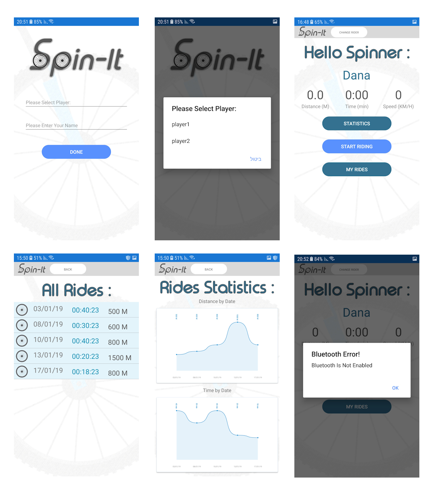

**A Project in Internet of Things (IoT) SSDL Lab, Computer Science Technion**

SpinIt is a bicycle racing game, controlled by physical bikes which are connected to an exercise device. The game allows it's players to do a spinning workout while they are playing. There is also a standalone app, which provides the player details about his cycling performance.

The Spin-It app on the phone/tablet provides the user with his riding time, current speed, the distance he has passed, and shows him some statistics regarding his riding history. 

[Time and distance count moving screen](./pics/moving_screen.mp4)

**This repository containes:**

* Cloud connection module code for the computer game in UNITY [here](./CloudConnectionUnity/Assets)
* The SpinIt mobile App [here](./SpinItApp)
* The arduino code [here]() #TODO ADD HERE
